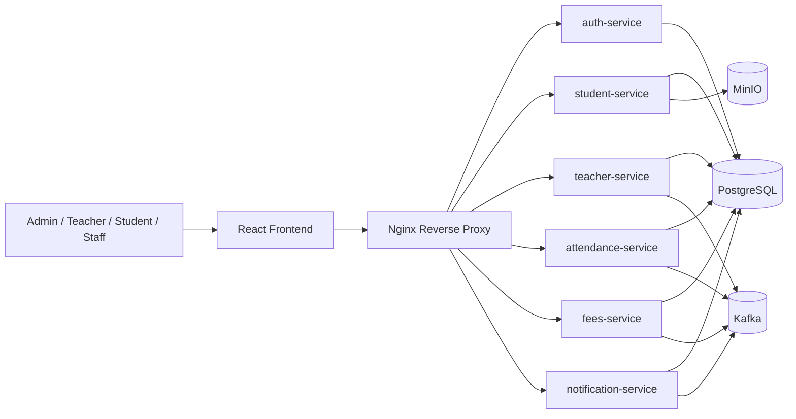
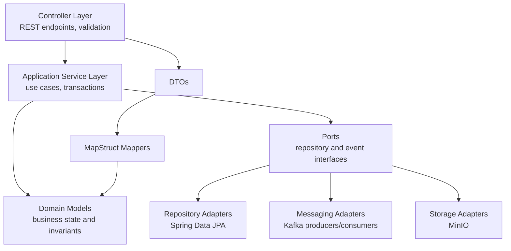
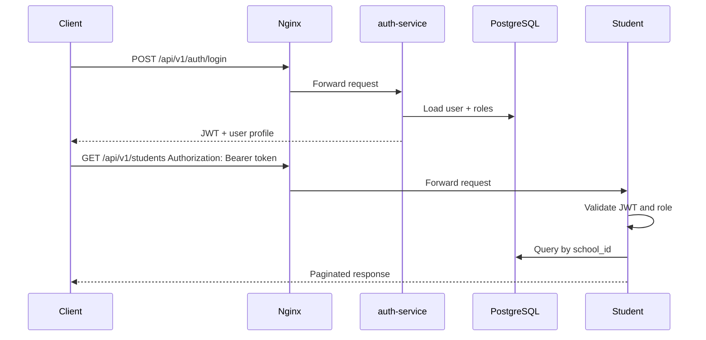

# Architecture

## System Context

## Backend Hexagonal Layout

## Modules

- `auth-service`: users, roles, JWT authentication, tenant/school context, audit logs.
- `student-service`: student profiles, class assignment, documents, guardians.
- `teacher-service`: teacher profiles, subjects, class allocations, marks entry.
- `attendance-service`: daily attendance, reports by class/date/student.
- `fees-service`: fee structure, payments, receipts, outstanding reports.
- `notification-service`: email, SMS mock provider, and in-app notifications.

## Multi-School Support

Every tenant-owned table carries `school_id`. Authentication embeds `schoolId`, user id, email, and roles in the JWT. Services must apply school scoping at repository/query boundaries and reject cross-school references.

## Request Flow

