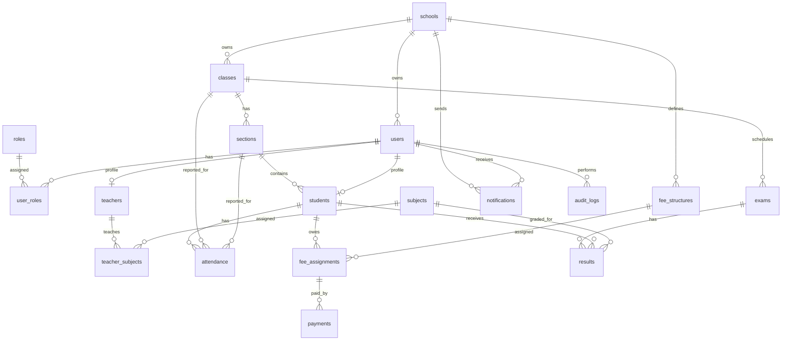

# Database Schema

The schema is normalized for SaaS-ready multi-school operation. Each operational table references `schools(id)` and uses UUID primary keys.

## ER Diagram

## Core Tables

- `schools`: tenant record.
- `users`: login identity, tenant scoped.
- `roles`, `user_roles`: RBAC.
- `students`, `teachers`, `staff_profiles`: people modules.
- `classes`, `sections`, `subjects`: academic structure.
- `attendance`: daily attendance by student/class/section/date.
- `fee_structures`, `fee_assignments`, `payments`: fee setup and tracking.
- `exams`, `results`: assessment and report card base.
- `documents`: MinIO object references.
- `notifications`: in-app/email/SMS notification tracking.
- `audit_logs`: immutable user action trail.

See the executable Flyway migration at [V1__init_schema.sql](/Users/mahi/Desktop/repo/school-management-system/auth-service/src/main/resources/db/migration/V1__init_schema.sql).

